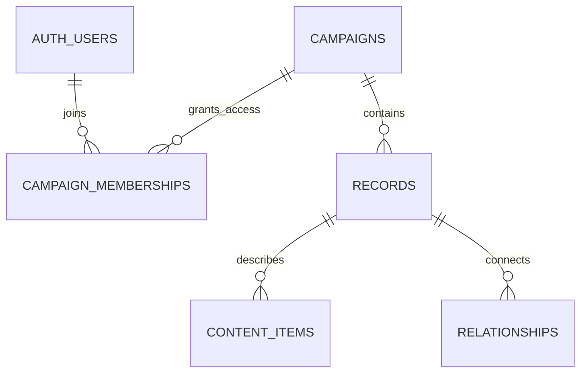

# Supabase schema review — Duluth by Night

Status: **reviewed initial schema, packaged as a versioned migration and locally tested; not applied to the Supabase project**. The website still loads its current JavaScript files. No live database, authentication, editing interface, or private-content transition has been activated.

A table is a collection of records; a row is one entry. A foreign key is a checked link between rows. Row-level security (RLS) makes Supabase return only the rows the signed-in user is allowed to read or change. These rules run in the database, not in a hidden frontend view.

The [initial migration](../supabase/migrations/20261007000100_campaign_schema.sql) contains the four reviewed chunks in one transaction. Follow [the SQL Editor setup guide](supabase-setup.md) to install it in a new project. It is a first-install migration, not a repeatable repair script.

## Chunk 1: the campaign and its users

Migration heading: `01_campaign_access.sql`.

| Table | One row represents | Main fields |
| --- | --- | --- |
| campaigns | A campaign, such as Duluth by Night | id, name, owner_user_id, settings |
| campaign_memberships | A signed-in user's access to one campaign | campaign_id, user_id, role, active, joined_at |
| auth.users | A login account managed by Supabase Auth | Supabase's user ID |

A person in the campaign is **not** a login account. Alan and the security officers are game records; your players' accounts are campaign memberships. You can connect a player account to a character later without combining the two identities.

Two stored roles cover the agreed rules: `storyteller` and `player`. Calling the Storyteller “DM” in conversation does not create another permission level. The campaign owner is the initial Storyteller and retains access even if their membership row is deactivated; other Storytellers receive the role explicitly. Owner transfer is an administrative operation. Players cannot grant themselves roles or invite themselves into another campaign.

| Action | Campaign player | Storyteller |
| --- | --- | --- |
| Read player-visible campaign records | Yes | Yes |
| Read unrevealed information | No | Yes |
| Read archived records | No | Yes |
| Edit shared Player notes | Yes, regardless of original author | Yes |
| Read/edit Storyteller notes | No | Yes |
| Reveal, archive, restore, or edit structured lore | No | Yes |
| Read change history and AI drafts | No | Yes |

Anonymous visitors receive only content explicitly marked public. Signing in does not automatically grant access to a campaign.



## Chunk 2: identities, geography, and content

Migration heading: `02_records_and_content.sql`.

### Records and their connections

`records` holds stable identities, names for headings, URL keys, and record types. It supports person, place, clan, organization, thread, scheme, session, event, discipline, power, and imported note. Existing IDs such as `person:alan-sovereign` and `place:watchtower` are retained. IDs are unique within a campaign; every foreign key also includes campaign ID, preventing accidental links into another campaign.

`record_names` stores aliases separately. Canal Park / The Rack remains one place with contextual names. A name change does not automatically change its route key.

`relationships` stores one typed connection and provides both directions in the interface. `relationship_types` defines valid endpoints and labels. The website can still omit reciprocal NPC rosters on discipline pages as requested; retaining links in data does not require displaying them everywhere.

Examples:

| From | Connection | To |
| --- | --- | --- |
| Watchtower | contained_in | Twig |
| Marcus Keene | member_of | Watchtower Security |
| Watchtower Security | protects | Watchtower |
| Alan | clan_member_of | Ventrue |

`contained_in` provides the geographic hierarchy. An active place has at most one primary geographic parent; cycles are rejected. Floors and rooms can remain nested entries until they need their own detail pages. Groups do not automatically inherit memberships just because they have a parent.

`membership_implications` stores the confirmed Night Forum → Anarchs rule. It applies to eligible connections such as confirmed membership, not generic association. Future database-aware queries must derive membership using only readable connections and rules; this draft does not create a privileged roster or search endpoint.

`domain_claims` remains separate from geography, ownership, or haven use. A claimant may be unknown. Archiving a claim preserves it rather than converting it into ownership.

### Sections and individual entries

`sections` organizes a record's page. `content_items` stores individual facts, bullets, schemes, histories, mechanics, and notes. Items can nest under other items. Section ownership and parent-item ownership are checked by foreign keys; cycles are rejected.

A fact can have its own audience without revealing the entire page. JSON is used for flexible **values**, not as an unchecked collection of unrelated hidden facts. For example, Strength and Finance are separate items; a scheme and its individually revealable steps can be separate items. Dice pools and system text remain authored text, not executable rules.

`item_references` stores inline links using checked record IDs. Subject-specific explanations can refer to a relationship, domain claim, or name through separate foreign keys. An unreadable relationship cannot leak through its explanation.

### Disciplines and powers

`power_definitions` assigns each power to exactly one discipline and level. Power descriptions, cost, dice pools, system, duration, and optional notes remain individual content items. The adapter will derive the existing `power_of` relationship and level field from this authoritative assignment rather than maintain two independently editable copies.

`selected_powers` links a person's discipline-rating item to an explicitly chosen power. Database checks ensure the power belongs to that discipline and does not exceed its rating. Changing a rating or a power level also validates existing selections. A rating never grants every listed power automatically.

### Death, archives, sources, and art

`person_status` holds the **For Real Dead?** property: `unknown`, `no`, or `yes`. It has optional death-date wording, details, and a session link. The whole death entry has its own audience. No value is inferred from age, biography, strikethrough, or archival state. “No” means recorded not permanently dead; it does not establish that the person is otherwise active or undead.

Most authored rows have `archived_at`, allowing entire records or individual entries/links to be archived. The main record also has an archive reason. An archived parent makes its children unavailable to players. Storytellers can read and restore all archived campaign content. Browser roles have no delete policies; normal tools archive rather than hard-delete. Permanent death does not archive a person automatically.

`sources`, source junction tables, and imported-note records preserve provenance and original imported text. Current screenshot-derived archives remain snapshots of imported text; future text/file originals should be stored completely and verbatim. Sources and their linked facts have independent audiences; revealing a fact does not reveal its entire source.

`attachments` stores asset references, alt text, captions, and optional artist credit. Existing asset paths survive as legacy paths. Future assets use a private `campaign-assets` storage bucket and paths beginning with campaign ID. Storytellers can access all assets for their campaign; players can retrieve only assets with readable attachment metadata and owners. Hiding a caption alone does not protect an image. Current files already published in GitHub stay public until deliberately removed from the static delivery path; RLS cannot retroactively privatize them.

`route_aliases` preserves existing bookmarks. `review_issues` retains uncertain geography and other migration questions for the Storyteller.

## Chunk 3: shared notes, changes, and AI suggestions

Migration heading: `03_history_and_integrity.sql`.

The two author-note fields remain content items:

- `notes.player`: campaign-player audience, one per person/place, editable by any active campaign player or Storyteller.
- `notes.storyteller`: Storyteller-only audience, one per person/place, editable only by the Storyteller. This field cannot be made player-visible; share a separate revealable lore entry instead.

Players update only the existing Player-note body. They cannot change its owner, title, role, audience, archive state, or other fields. Storyteller tools create the initial blank note rows. Both use server-maintained `updated_by`, `updated_at`, and `revision` fields. Future editors must submit updates with the revision they originally read and handle zero updated rows as a conflict, so one player does not silently overwrite another's newer changes. The SQL test covers this conditional-update pattern; the UI/editor is not built yet.

`change_events` is an append-only audit table. Inserts, updates, archives/restores, membership changes, and relevant structural changes capture actor, time, origin, before/after row data, and any approved AI proposal. Players cannot read the audit table: before-values may contain unrevealed material. Browser users cannot forge or rewrite audit events. The database owner still has administrative power; this is an application audit trail, not cryptographic tamper-proof storage.

`change_proposals` stores drafts with target, expected revision, proposed values, reason, and optional AI model/context. The Storyteller approves or rejects a draft. Approval by itself does **not** change a campaign entry. A later apply tool must execute the approved change transactionally.

AI-attributed writes require an approved AI proposal matching the target table, ID, previous revision, and proposed values. Reusing stale approval is rejected. Human approval and application are recorded. Future AI tools should receive draft-only access through a controlled server function—not a service-role key with unrestricted database access. Proposal/application UI and automation are deliberately not implemented by this schema draft.

Human editing tools must explicitly identify their write origin as `human` (and clear an old proposal link); import tools use `import`; approved AI tools use `ai_approved`. Player-note writes are marked human automatically.

## Chunk 4: reveals and database permissions

Migration heading: `04_permissions.sql`.

Each permissioned row has one audience:

| Audience | Who can read it |
| --- | --- |
| storyteller | Storytellers for this campaign |
| players | All active campaign members, including Storytellers |
| public | Anyone, if its parent records/sections are also readable |

New rows default to Storyteller-only. Reveals change a particular entry's audience to `players`; they do not need grants for individual players. Reveals, reversals, and archival changes are audited. Players do not control reveal settings.

Permissions check owning records, sections, ancestors of nested entries, and relevant linked endpoints. A revealed child under an unreadable parent remains unreadable. The Storyteller can inspect all existing rows for their campaign regardless of audience or archive status. This does not grant access to somebody else's campaign.

Authentication, search, and database-loading code must later use the caller's token and RLS-visible rows. A server must not fetch everything with an administrative key and filter it in JavaScript. Storage checks are included, but real Supabase Auth/session and Storage delivery still need end-to-end verification in the project before the site transition.

## Current export and validation

The current runtime dataset contains **84 records, 241 sections, 443 items, and 143 relationships**. The dry-run export maps fourteen power assignments/levels into typed definitions, leaving 429 content items and 129 ordinary relationships. There is one explicitly selected power, 27 people with unknown initial permanent-death state, two claims, and three archived-note records ("archived-note" here means preserved source text, not archived_at).

Generate a local review bundle:

```sh
node scripts/export-supabase-draft.cjs --out /tmp/campaign-draft.json
```

It includes normalized table rows, a full original dataset snapshot, counts, and caveats. It never contacts Supabase. Player notes get campaign-player audience; all other imported rows default to Storyteller-only pending review. This is intentional, not an automatic withdrawal of the current public site. Homepage view configuration is retained in the original snapshot pending a permission-aware adapter; it is not blindly exposed through public campaign settings.

Run local SQL checks with Docker:

```sh
bash scripts/test-supabase-draft.sh
```

This creates a temporary PostgreSQL 17 container without an exposed port or persistent volume. Tests provide minimal Supabase Auth and Storage stubs, apply the versioned migration, import all current rows, and exercise two players, Storyteller, revoked member, and anonymous access. They check shared edits, hidden parent/section/nested entries, private death status and assets, role escalation, audit visibility, reveals, cross-campaign references, graph/type checks, power-rating changes, archives/restores, and AI approval requirements. The container is removed afterward.

The files under `tests/postgres` contain mock account IDs and are **not scripts to run against your real Supabase project**. Local stubs validate PostgreSQL policies; they do not replace a staging test with real Supabase tokens and Storage APIs.

## What follows this review

1. Review the four chunks and audience choices. The settled campaign-wide player rules do not need re-confirming.
2. Apply the prepared versioned migration and initialize the campaign owner using their real Supabase Auth user ID, following the setup guide.
3. Exercise the schema in the project with real Storyteller/player accounts and signed storage access.
4. Preview the import, explicitly choose players/public audiences, and verify counts, provenance, routes, names, and unknown values.
5. Build a database adapter behind the existing presentation model, followed by authenticated editing and draft-application tools.

The static frontend is unchanged by this review. No secrets, project URL, database password, or administrative key is needed to review these files.
